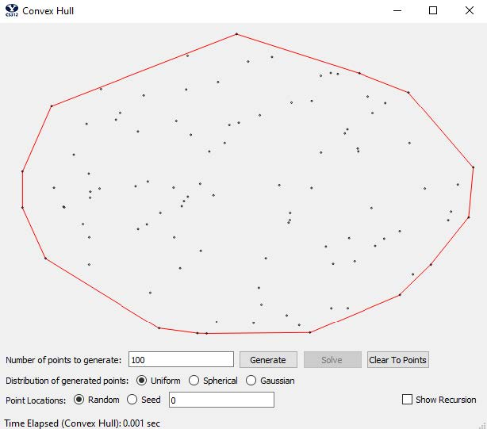
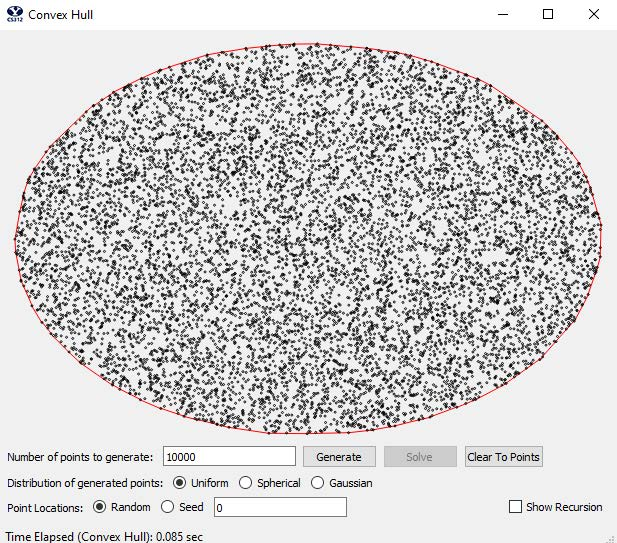
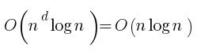

# Convex Hull

This project uses [divide and conquer](https://en.wikipedia.org/wiki/Divide-and-conquer_algorithm) to find the [convex hull](https://en.wikipedia.org/wiki/Convex_hull) of any given array of points.

To see the implementation, see [convex_hull.py](convex_hull.py).

## Results

For the full report (such as Big-O complexity and explanation), see [Report.pdf](Convex%20Hull%20-%20Report.pdf)

#### Size 100

#### Size 10,000

#### Big-O

#### Empirical vs Theoretical Results

